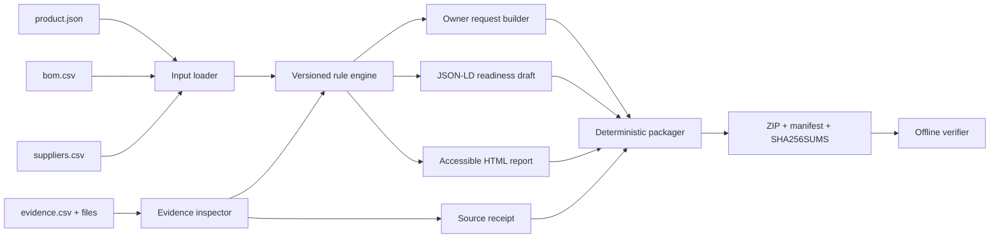

# Architecture

DPP Preflight is a local-first Node.js CLI with one runtime dependency for QR encoding. The analysis path makes no network requests.

## Modules

| Module | Responsibility |
| --- | --- |
| `src/model.js` | Load four fixed input files, coerce numeric fields, reject duplicate IDs and escaping evidence paths |
| `src/evidence.js` | Read evidence bytes and compute hashes, existence, validity, and future-date state |
| `src/rules.js` | Evaluate data-driven checks and produce structured findings |
| `src/requests.js` | Map failing finding details to known supplier or internal owners |
| `src/draft.js` | Produce a deterministic JSON-LD readiness draft |
| `src/report.js` | Render a self-contained HTML report with escaped source text |
| `src/zip.js` | Write and read deterministic STORE-only ZIP archives with CRC checking |
| `src/package.js` | Orchestrate outputs, manifests, checksums, atomic replacement, and verification |
| `src/cli.js` | Parse commands and provide stable exit codes |

## Determinism

`analyze` accepts an explicit `--as-of` timestamp. With identical input bytes, rule pack, tool version, and timestamp:

- JSON keys are recursively sorted.
- CSV output columns and rows have deterministic ordering.
- ZIP entries are lexically ordered.
- ZIP timestamps derive only from `--as-of`.
- ZIP compression is disabled, avoiding library or platform variance.

Tests generate the same product twice in separate directories and compare the archive bytes.

## Trust boundaries

### Trusted enough to process

- The selected rule pack JSON.
- Files inside the named input directory.
- Explicit CLI paths.

### Untrusted content

- All product, component, supplier, and evidence metadata.
- Evidence file bytes.
- ZIPs passed to `verify`.

Controls include HTML escaping, relative-path confinement, unique-key checks, ZIP path rejection, CRC checks, manifest shape checks, SHA-256 and size verification, and refusal to overwrite an existing output without `--force`.

### Claims intentionally not made

- A matching SHA-256 does not identify an author.
- A deterministic timestamp is not a trusted timestamp.
- A 100 score means this horizontal source-data pack has no blocking gaps; it does not mean legal compliance.
- A generated QR has not been tested on printed packaging or with every resolver.

## Extension seams

Rule packs are immutable versioned JSON files. New product-specific packs can reuse the existing handlers or introduce a reviewed handler in `src/rules.js`. New output adapters should consume the structured analysis result and must not mutate source data.
